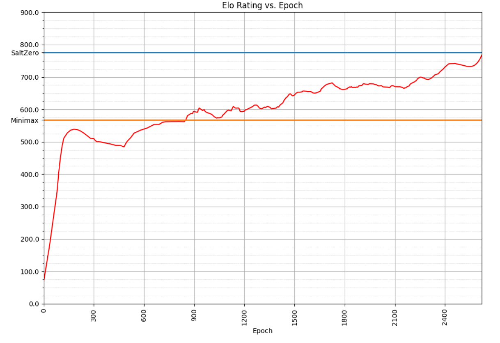

# DescentSelf-learningUTTT

Self-play AI for **Ultimate Tic-Tac-Toe** based on **Descent (UBFM) + Neural Network**.  
C++ bitboard engine + Python training pipeline, expert-based self-play, unified tournament harness, and **Bayes Elo** evaluation.

---

## Why this matters

- **Alternative to AlphaZero-style MCTS:** Descent + NN shows competitive strength in UTTT while using a different search paradigm.  
- **Full-stack research → engineering:** from bit-level game state and fast move generation to batched NN evaluation, self-play data loops, and reproducible rankings.  
- **Robust benchmarking:** large evaluation pool, fixed time-per-move, optimal pairing graph for Bayes Elo → more reliable comparisons.

---

## Key results (evaluation)

- **Evaluation pool:** 29,527 games, **0.5s/move** hard limit per player.  
- **Final Bayes Elo (mean ± CI):**  
  - **Descent (with experts): 764 ± 15**  
  - **SaltZero (AlphaZero-style baseline): 776 ± 7**  
  - Descent (no experts): 534 ± 11  
  - Minimax (Negamax α–β, iterative-deepening): 567 ± 14

> The expert-based training variant approaches the SaltZero baseline and clearly surpasses Minimax.

---

## Learning curve (Elo vs. Epoch)

  

**Notes**
- The red curve shows the model’s Elo across training epochs (Bayes Elo, 0.5s/move, unified tournament system).
- Horizontal lines: **SaltZero ≈ 780** (blue) and **Minimax ≈ 565** (orange) as reference baselines.
- Rapid early gains followed by steady improvement; the model approaches SaltZero’s strength in later epochs.

---

## Architecture (high-level)

**C++ core**
- **Bitboard engine (`BigBoard`)** with precomputed 3×3 boards for fast legality and terminal checks.  
- **Descent search** with **`BatchEvaluator`** for batched NN evaluation of non-terminal states.  
- **Self-play loop** writing experience to a shared buffer (`ReplayBuffer`), **experience replay** via `SampleTrainer`.  
- **SharedMemory / pybind11 bridge** exposing zero-copy NumPy views for channels/values and calling Python `Evaluate()` / `Learn()`.

**Python side**
- **ModelWrapper / ModelManager** (TensorFlow/Keras): checkpointing, switching between **main** and **expert** networks.  
- **Shared-memory script** to map C++ buffers as NumPy arrays and run batched training/inference (GPU).  
- **Expert regime:** periodically load top past checkpoints as “experts” to stabilize and accelerate learning.

> Outcome: fast move generation in C++, batched GPU NN in Python, tight coupling without redundant copies.

---

## Players compared (summary)

| Player                       | Approach                         | Bayes Elo |
|-----------------------------|----------------------------------|-----------|
| **Descent (with experts)**  | UBFM + NN, self-play w/ experts  | **764 ± 15** |
| **SaltZero**                | AlphaZero-style (MCTS + NN)      | **776 ± 7** |
| Descent (no experts)        | UBFM + NN                        | 534 ± 11  |
| Minimax (Negamax α–β)       | Classic search                   | 567 ± 14  |

Notes: same time control (**0.5s/move**), common tournament harness, and Bayes Elo computation.

---

## Repository structure (as-is)

> Code and thesis materials live under `projects/` (engine, training scripts, evaluation pipeline, diagrams/tables).

---

## Reproducing thesis results (outline)

1. **Self-play & training schedule.** Alternate epochs: self-play data collection → training on sampled batches (experience replay). Maintain **main** checkpoints and a small pool of **experts** (top past checkpoints).
2. **Expert-based training.** Early epochs use experts exclusively for state evaluation; later, interleave experts with the current main net on a fixed cadence to stabilize learning.
3. **Tournament set.** Build N checkpointed players (e.g., 100). Generate a **d-regular pairing graph** that **maximizes algebraic connectivity (Fiedler λ₂)** to ensure indirect comparability when not all pairs meet directly.
4. **Play & collect.** Fixed time-per-move (0.5s), fixed encounters per pair (even count to balance first-move advantage). Export results to **PGN**.
5. **Rating.** Compute **Bayes Elo** from the PGN set; plot Elo vs. epoch for learning curves and report the final table.

---

## License & acknowledgments
- **License:** GPL-3.0  
- **References:** Descent/UBFM, AlphaZero line of work, Bayes Elo methodology, algebraic connectivity (Fiedler) for pairing graphs.

---

## Krótko po polsku (PL)
Projekt systemu samouczącego się dla **Ultimate Tic-Tac-Toe**: silnik C++ (bitboard), sieć w Pythonie (TensorFlow/Keras), uczenie z **ekspertami**. W testach (**29 527 gier**, **0.5s/ruch**) system **Descent + NN** osiąga **764 ± 15 Bayes Elo**, blisko **SaltZero 776 ± 7** i powyżej **Minimax 567 ± 14**. Ranking oparty na **Bayes Elo** i doborze par o maksymalnej łączności algebraicznej (Fiedler λ₂).

## Short summary (EN)
Self-play AI for **Ultimate Tic-Tac-Toe** using **Descent (UBFM) + NN**. C++ bitboard engine, Python training, expert-based regime. In **29,527** games at **0.5s/move**, **Descent+experts** scores **764 ± 15 Bayes Elo**, near **SaltZero 776 ± 7**, above **Minimax 567 ± 14**. Robust evaluation via **Bayes Elo** with an algebraically connected pairing graph (Fiedler λ₂).
